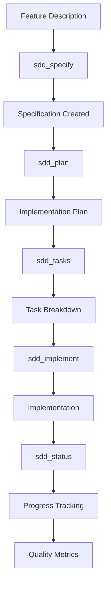

# SDD MCP Server

**Specification-Driven Development Model Context Protocol Server**

[](https://github.com/asimsinan/sdd-mcp-server)
[](LICENSE)
[](package.json)

An AI-powered MCP server that implements **Specification-Driven Development** (SDD) workflow through intelligent tools. This server provides a complete development lifecycle from specification to implementation, ensuring high-quality, test-driven code that follows constitutional principles.

## 🚀 What is SDD?

**Specification-Driven Development** flips the traditional development hierarchy: **specifications are executable** and generate the implementation. Code serves specs, not the other way around.

### Core Principles
- **Intent before mechanism**: *What* and *why* precede *how*
- **Multi-step refinement** over one-shot code generation
- **Library-first** and **integration-first** testing
- **Test-Driven Development** with strict ordering
- **Constitutional gates** that enforce quality standards

## 🛠️ Available Tools

The MCP server provides 6 powerful tools that guide you through the complete SDD workflow:

### 1. **sdd_specify** - Create Feature Specifications
**Input**: Free-form feature description  
**Output**: AI instructions to create comprehensive specification template

- ✅ Auto-detects existing specifications to avoid conflicts
- ✅ Creates timestamped feature branches
- ✅ Saves templates to database for future reference
- ✅ Provides AI instructions for specification creation

### 2. **sdd_plan** - Generate Implementation Plans
**Prerequisites**: Complete specification (no `[NEEDS CLARIFICATION]` markers)  
**Output**: AI instructions to create detailed implementation plan

- ✅ Applies **Constitutional Gates** (fail-fast if violated)
- ✅ Enforces **Library-First** approach
- ✅ Validates **Test-First** methodology
- ✅ Generates platform-specific planning

### 3. **sdd_tasks** - Derive TDD Tasks
**Prerequisites**: Implementation plan exists  
**Output**: AI instructions to create task breakdown with TDD ordering

- ✅ **Strict TDD ordering**: Contract → Integration → E2E → Unit → Implementation
- ✅ Caps task size (~200 LOC per task)
- ✅ Marks parallelizable tasks with `[P]`
- ✅ Generates beautiful Mermaid diagrams

### 4. **sdd_status** - Track Progress
**Input**: Optional phase/task parameters  
**Output**: Comprehensive status report with implementation tracking

- ✅ Detects active feature by current branch
- ✅ Tracks implementation progress
- ✅ Provides quality metrics and analytics
- ✅ Checks constitutional compliance

### 5. **sdd_implement** - Execute Implementation
**Input**: Phase number (1-8) for targeted implementation  
**Output**: AI instructions for implementation with quality checks

- ✅ **8-phase implementation** with specific instructions
- ✅ Comprehensive quality check sequences
- ✅ Dependency installation guidance
- ✅ Progress tracking and analytics

### 6. **sdd_db_filler** - Database Operations
**Input**: Table name, operation type, and data  
**Output**: Database operation results

- ✅ Generic database operations
- ✅ Data validation and integrity
- ✅ Support for all SDD tables

## 🏛️ Constitutional Gates

The server enforces **26 constitutional gates** that ensure quality and maintainability:

### Core Gates (All Platforms)
- **Simplicity Gate**: ≤ 5 projects for initial scope
- **Library-First Gate**: Every feature starts as standalone library
- **CLI Interface Gate**: CLI with `--json` mode for developer tools
- **Test-First Gate**: Contract → Integration → E2E → Unit → Implementation
- **Integration-First Testing**: Prefer real dependencies over mocks
- **Anti-Abstraction Gate**: Single domain model
- **Traceability Gate**: Every line traces to numbered requirement

### Platform-Specific Gates
- **Mobile**: Native-First, Offline-First, Performance, Accessibility, Security, Store Compliance
- **Web**: Progressive Enhancement, Responsive Design, Browser Compatibility, API-First
- **Desktop**: Native Integration, Distribution, CLI Interface
- **Backend**: API-First, Database, Monitoring, CLI Interface
- **AI**: Data Quality, Model Performance, Reproducibility, Ethics, Deployment

## 📦 Installation

### Prerequisites
- Node.js ≥ 18.0.0
- Git (for feature branch management)

### Install from NPM
```bash
# Install globally
npm install -g @asimsinan/sdd-mcp-server

# Or install locally in your project
npm install @asimsinan/sdd-mcp-server
```

### Build from Source
```bash
# Clone the repository
git clone https://github.com/asimsinan/sdd-mcp-server.git
cd sdd-mcp-server

# Install dependencies
npm install

# Build the project
npm run build:complete

# Install globally
npm run install:global
```

## 🚀 Quick Start

### 1. Initialize Your Project
```bash
# Navigate to your project directory
cd your-project

# The server will auto-detect your project root
# or set PROJECT_ROOT environment variable
export PROJECT_ROOT=/path/to/your/project
```

### 2. Start the MCP Server
```bash
# Run the server
sdd-mcp

# Or with Node.js
node dist/index.js
```

### 3. Use with Cursor or MCP Client
The server provides MCP tools that can be called from:
- **Cursor** (AI code editor)
- **Claude Desktop** (with MCP support)
- Any MCP-compatible client

### 4. Example Workflow
```bash
# 1. Create a specification
# Call sdd_specify with your feature description

# 2. Generate implementation plan
# Call sdd_plan (after specification is complete)

# 3. Create task breakdown
# Call sdd_tasks (after plan is created)

# 4. Check status
# Call sdd_status to see progress

# 5. Implement features
# Call sdd_implement with phase number (1-8)
```

## 🏗️ Project Structure

The server enforces a specific project structure:

```
src/
├── lib/[feature-name]/          # Library implementation
│   ├── models/                  # Data models
│   ├── services/                # Business logic
│   └── cli.(ts|py|rs|go)        # Command interface
├── contracts/                   # API specifications
└── tests/
    ├── contract/                # Contract tests
    ├── integration/             # Integration tests
    └── unit/                    # Unit tests
```

## 🎯 Supported Platforms

- **Mobile**: iOS, Android with native-first approach
- **Web**: Progressive web apps with responsive design
- **Desktop**: Cross-platform desktop applications
- **Backend**: API-first backend services
- **AI**: Machine learning and AI applications

## 🔧 Configuration

### Environment Variables
```bash
# Set project root (optional - auto-detected)
export PROJECT_ROOT=/path/to/your/project

# Database location (optional - defaults to sdd.db)
export SDD_DB_PATH=/path/to/sdd.db
```

### Database
The server uses SQLite for storing:
- Feature specifications
- Implementation plans
- Task breakdowns
- Status reports
- Implementation progress
- Quality metrics

## 📊 Quality Features

- **Comprehensive Linting**: ESLint with TypeScript support
- **Type Safety**: Full TypeScript implementation
- **Error Handling**: Robust error handling and validation
- **Testing**: TDD-first approach with comprehensive coverage
- **Documentation**: Self-documenting code with comprehensive comments
- **Analytics**: Quality scores and implementation metrics

## 🚨 Enforcement Rules

### Before ANY Implementation
1. **Spec must exist** (`spec.md`)
2. **Plan must exist** (`plan.md`)
3. **Tests must be written first** (contract/integration/E2E/unit)
4. **Constitutional gates must pass** or be justified

### During Implementation
- **Strict Red → Green → Refactor**
- **Library-first**; app code stays thin
- **Prefer real dependencies**; justify mocks
- **Fail early** on violations; fix before proceeding

## 📈 Development Workflow



## 🤝 Contributing

1. Fork the repository
2. Create a feature branch: `git checkout -b feat/amazing-feature`
3. Follow the SDD workflow for your changes
4. Commit your changes: `git commit -m 'Add amazing feature'`
5. Push to the branch: `git push origin feat/amazing-feature`
6. Open a Pull Request

## 📝 License

This project is licensed under the MIT License - see the [LICENSE](LICENSE) file for details.

## 🆘 Support

- **Issues**: [GitHub Issues](https://github.com/asimsinan/sdd-mcp-server/issues)
- **Documentation**: [GitHub Wiki](https://github.com/asimsinan/sdd-mcp-server/wiki)
- **Discussions**: [GitHub Discussions](https://github.com/asimsinan/sdd-mcp-server/discussions)

## 🙏 Acknowledgments

- Built with [Model Context Protocol](https://modelcontextprotocol.io/)
- Powered by [TypeScript](https://www.typescriptlang.org/)
- Database: [SQLite](https://www.sqlite.org/)
- Testing: [Jest](https://jestjs.io/)

---

**Version**: 2.3.0  
**Last Updated**: 2025-01-27  
**Author**: Asim Sinan Yuksel
