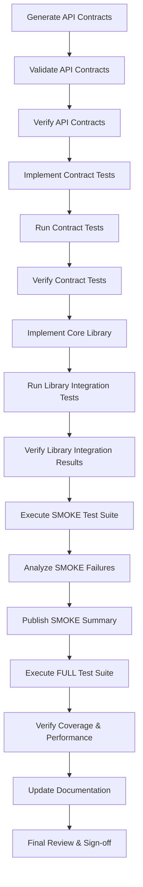
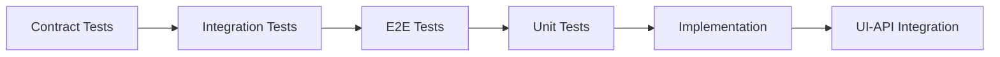
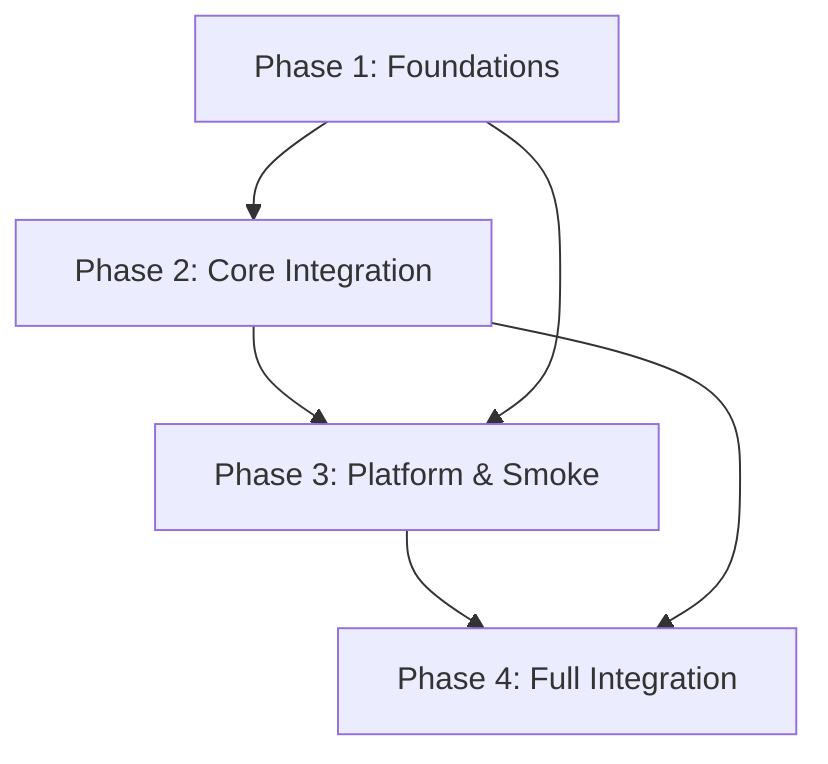

# 📋 Video Conferencing Web App - Task Planning

## 📊 Task Summary
---

**Total Phases:** 4 phases covering complete development lifecycle.

**Total Tasks:** 49 tasks with clear dependencies and parallelization opportunities.

**Core Phases:** Phase 1-4 covering complete implementation following TDD order.

---

**Note:** All tasks numbered sequentially to ensure AI attention and complete implementation coverage. Tasks marked with [P] can be parallelized for faster development.

## ⏱️ Time Estimation
---

### 🎯 Duration Estimation Guide
**Project Complexity:** High complexity video conferencing application with WebRTC, WebSockets, and real-time features.

**Technology Stack:** Next.js, TypeScript, Tailwind CSS, WebRTC, WebSockets, PostgreSQL

**Team Composition:** 4-5 developers (Frontend, Backend, Full-Stack, DevOps)

**Duration Ranges:**
- **Contract:** 10-45min (API contracts, validation, schema design)
- **Integration:** 15-60min (Integration tests, scenarios, verification)
- **Unit:** 5-30min (Unit tests, model tests, verification)
- **Implementation:** 20-120min (Core implementation, documentation)
- **E2E:** 30-180min (End-to-end testing, smoke tests, final verification)

### 📈 Project-Level Estimates
- **Total Sequential Duration:** 18-26 hours
- **Total Parallel Duration:** 12-18 hours
- **Parallel Execution Savings:** 6-8 hours (33-43% time savings)
- **Critical Path:** TASK-001 → TASK-024 → TASK-041 → TASK-049
- **Parallelization Level:** High (60-70% of tasks can run in parallel)

## 🎯 Project Overview
---

### 🚀 Execution Strategy
**Recommended Approach:** Parallel execution with dependency management
- Phase 1: Foundation tasks run in parallel groups
- Phase 2: Core implementation with integration testing
- Phase 3: API-first development with platform optimization
- Phase 4: Full integration and verification

### 📊 Phase Breakdown
- **Phase 1:** 6-9 hours (Foundations & Data)
- **Phase 2:** 2-3 hours (Application & Core Integration)
- **Phase 3:** 3-4 hours (API-First, Platform & Smoke)
- **Phase 4:** 1-2 hours (Full Integration & Verification)

### 👥 Resource Requirements
- **Team Size:** 4-5 developers
- **Skills:** React, TypeScript, Node.js, PostgreSQL, WebRTC
- **Parallel Execution:** High (60-70% tasks parallelizable)

## 📝 Task Breakdown

### 🔬 Phase 1: Foundations & Data (Atomic)
**Duration:** 6-9 hours | **Tasks:** 23 | **Focus:** Contracts, tests, integration scenarios, DB/schema/migrations, models, and unit verification

#### Contract Phase (TDD Order: Contract → Integration → E2E → Unit → Implementation)

**TASK-001** [Contract] Generate API Contracts (OpenAPI)
- **Duration:** 30min
- **Description:** Create comprehensive OpenAPI 3.0 specification for video conferencing API including room management, WebSocket signaling, and chat endpoints
- **Acceptance Criteria:** Complete OpenAPI spec with all 10 endpoints documented, request/response schemas defined, validation rules specified
- **Constitutional Compliance:** ✅ API-First Gate compliance with comprehensive API documentation
- **Dependencies:** None
- **Parallelizable:** No

**TASK-002** [Contract] Validate API Contracts
- **Duration:** 20min
- **Description:** Validate OpenAPI specification against video conferencing requirements and ensure all functional requirements are covered
- **Acceptance Criteria:** All FR-001 to FR-015 requirements mapped to API endpoints, schema validation passes, no missing endpoints
- **Constitutional Compliance:** ✅ Traceability Gate compliance with requirement mapping
- **Dependencies:** TASK-001
- **Parallelizable:** Yes [P]

**TASK-003** [Contract] Verify API Contracts
- **Duration:** 15min
- **Description:** Verify API contracts meet constitutional gates and platform-specific requirements for web application
- **Acceptance Criteria:** Progressive enhancement support, responsive design considerations, browser compatibility verified
- **Constitutional Compliance:** ✅ Platform-specific gates compliance
- **Dependencies:** TASK-002
- **Parallelizable:** Yes [P]

**TASK-004** [Contract] Implement Contract Tests
- **Duration:** 45min
- **Description:** Generate contract tests from OpenAPI specification using Pact or Dredd for automated API testing
- **Acceptance Criteria:** Contract tests generated for all endpoints, tests fail initially (Red phase), comprehensive test coverage
- **Constitutional Compliance:** ✅ Test-First Gate compliance with contract tests before implementation
- **Dependencies:** TASK-003
- **Parallelizable:** Yes [P]

**TASK-005** [Contract] Run Contract Tests
- **Duration:** 10min
- **Description:** Execute contract tests to verify they fail as expected (Red phase of TDD)
- **Acceptance Criteria:** All contract tests fail as expected, test execution completes successfully
- **Constitutional Compliance:** ✅ Test-First Gate compliance with Red phase verification
- **Dependencies:** TASK-004
- **Parallelizable:** Yes [P]

**TASK-006** [Contract] Verify Contract Tests (Pass/Fail & Coverage)
- **Duration:** 15min
- **Description:** Verify contract test results and ensure comprehensive coverage of all API endpoints
- **Acceptance Criteria:** Test coverage ≥ 90%, all tests properly fail, coverage report generated
- **Constitutional Compliance:** ✅ Test-First Gate compliance with coverage verification
- **Dependencies:** TASK-005
- **Parallelizable:** Yes [P]

#### Integration Phase

**TASK-007** [Integration] Define Integration Test Scenarios
- **Duration:** 30min
- **Description:** Create comprehensive integration test scenarios for video conferencing functionality including WebRTC connections and real-time messaging
- **Acceptance Criteria:** Integration scenarios cover room creation, joining, WebRTC signaling, chat messaging, screen sharing
- **Constitutional Compliance:** ✅ Integration-First Testing Gate compliance with real dependencies
- **Dependencies:** TASK-003
- **Parallelizable:** Yes [P]

**TASK-008** [Integration] Execute Integration Scenarios
- **Duration:** 45min
- **Description:** Execute integration test scenarios using real WebRTC connections and WebSocket communication
- **Acceptance Criteria:** Integration tests execute successfully, real dependencies used (PostgreSQL, WebRTC, WebSockets)
- **Constitutional Compliance:** ✅ Integration-First Testing Gate compliance with real dependencies
- **Dependencies:** TASK-007
- **Parallelizable:** Yes [P]

**TASK-009** [Integration] Verify Integration Scenarios & Report
- **Duration:** 20min
- **Description:** Verify integration test results and generate comprehensive report with performance metrics
- **Acceptance Criteria:** Integration tests pass, performance metrics within targets, detailed report generated
- **Constitutional Compliance:** ✅ Integration-First Testing Gate compliance with verification
- **Dependencies:** TASK-008
- **Parallelizable:** Yes [P]

#### Database & Schema Phase

**TASK-010** [Contract] Configure Database
- **Duration:** 25min
- **Description:** Configure PostgreSQL database with connection pooling, security settings, and performance optimization
- **Acceptance Criteria:** Database configured with proper connection pooling, security settings applied, performance optimized
- **Constitutional Compliance:** ✅ Database Gate compliance with proper configuration
- **Dependencies:** TASK-003
- **Parallelizable:** Yes [P]

**TASK-011** [Contract] Initialize Database
- **Duration:** 15min
- **Description:** Initialize PostgreSQL database with proper user permissions and initial configuration
- **Acceptance Criteria:** Database initialized successfully, user permissions configured, initial setup complete
- **Constitutional Compliance:** ✅ Database Gate compliance with proper initialization
- **Dependencies:** TASK-010
- **Parallelizable:** Yes [P]

**TASK-012** [Contract] Verify Database Setup
- **Duration:** 10min
- **Description:** Verify database setup and connectivity with comprehensive health checks
- **Acceptance Criteria:** Database connectivity verified, health checks pass, performance metrics within targets
- **Constitutional Compliance:** ✅ Database Gate compliance with verification
- **Dependencies:** TASK-011
- **Parallelizable:** Yes [P]

**TASK-013** [Contract] Design Database Schema
- **Duration:** 40min
- **Description:** Design comprehensive database schema for video conferencing with rooms, users, messages, and media streams
- **Acceptance Criteria:** Schema designed with proper relationships, indexes, constraints, ACID compliance
- **Constitutional Compliance:** ✅ Database Gate compliance with proper schema design
- **Dependencies:** TASK-010
- **Parallelizable:** Yes [P]

**TASK-014** [Contract] Verify Database Schema
- **Duration:** 20min
- **Description:** Verify database schema design meets all requirements and performance targets
- **Acceptance Criteria:** Schema verification passes, performance targets met, all constraints validated
- **Constitutional Compliance:** ✅ Database Gate compliance with schema verification
- **Dependencies:** TASK-013
- **Parallelizable:** Yes [P]

**TASK-015** [Contract] Implement Migration Scripts
- **Duration:** 35min
- **Description:** Create database migration scripts with proper versioning and rollback capabilities
- **Acceptance Criteria:** Migration scripts created with versioning, rollback capabilities, tested migrations
- **Constitutional Compliance:** ✅ Database Gate compliance with proper migrations
- **Dependencies:** TASK-014
- **Parallelizable:** Yes [P]

**TASK-016** [Contract] Apply Migration Scripts
- **Duration:** 15min
- **Description:** Apply database migration scripts to create initial schema
- **Acceptance Criteria:** Migrations applied successfully, schema created, no errors during migration
- **Constitutional Compliance:** ✅ Database Gate compliance with migration application
- **Dependencies:** TASK-015
- **Parallelizable:** Yes [P]

**TASK-017** [Contract] Verify Migrations (Integrity & Rollback)
- **Duration:** 25min
- **Description:** Verify migration integrity and test rollback procedures
- **Acceptance Criteria:** Migration integrity verified, rollback procedures tested, data integrity maintained
- **Constitutional Compliance:** ✅ Database Gate compliance with migration verification
- **Dependencies:** TASK-016
- **Parallelizable:** Yes [P]

#### Data Models Phase

**TASK-018** [Contract] Develop Data Models
- **Duration:** 50min
- **Description:** Create TypeScript data models for Room, User, Message, MediaStream, and Connection entities
- **Acceptance Criteria:** Data models created with proper types, validation, relationships, single domain model approach
- **Constitutional Compliance:** ✅ Anti-Abstraction Gate compliance with single domain model
- **Dependencies:** TASK-014
- **Parallelizable:** Yes [P]

**TASK-019** [Contract] Lint/Type-Check Data Models
- **Duration:** 15min
- **Description:** Run linting and type checking on data models to ensure code quality
- **Acceptance Criteria:** Linting passes, type checking passes, code quality standards met
- **Constitutional Compliance:** ✅ Code quality compliance with linting and type checking
- **Dependencies:** TASK-018
- **Parallelizable:** Yes [P]

**TASK-020** [Contract] Verify Data Models
- **Duration:** 20min
- **Description:** Verify data models meet all requirements and constitutional compliance
- **Acceptance Criteria:** Data models verified, all requirements met, constitutional compliance confirmed
- **Constitutional Compliance:** ✅ Anti-Abstraction Gate compliance with verification
- **Dependencies:** TASK-019
- **Parallelizable:** Yes [P]

#### Unit Testing Phase

**TASK-021** [Unit] Implement Model Unit Tests
- **Duration:** 40min
- **Description:** Create comprehensive unit tests for all data models with proper test coverage
- **Acceptance Criteria:** Unit tests created for all models, test coverage ≥ 80%, tests fail initially
- **Constitutional Compliance:** ✅ Test-First Gate compliance with unit tests before implementation
- **Dependencies:** TASK-018
- **Parallelizable:** Yes [P]

**TASK-022** [Unit] Run Model Unit Tests
- **Duration:** 10min
- **Description:** Execute unit tests to verify they fail as expected (Red phase of TDD)
- **Acceptance Criteria:** All unit tests fail as expected, test execution completes successfully
- **Constitutional Compliance:** ✅ Test-First Gate compliance with Red phase verification
- **Dependencies:** TASK-021
- **Parallelizable:** Yes [P]

**TASK-023** [Unit] Verify Model Tests (Coverage ≥ Target)
- **Duration:** 15min
- **Description:** Verify unit test coverage meets target and all tests properly fail
- **Acceptance Criteria:** Test coverage ≥ 80%, all tests fail as expected, coverage report generated
- **Constitutional Compliance:** ✅ Test-First Gate compliance with coverage verification
- **Dependencies:** TASK-022
- **Parallelizable:** Yes [P]

---

### 🔗 Phase 2: Application & Core Integration (Atomic)
**Duration:** 2-3 hours | **Tasks:** 8 | **Focus:** Implements core library, app layer, UI–API integration, and verification flows

#### Core Library Implementation

**TASK-024** [Implementation] Implement Core Library
- **Duration:** 120min
- **Description:** Implement core WebRTC connection manager, room state manager, media stream handler, and chat message handler libraries
- **Acceptance Criteria:** Core libraries implemented with proper error handling, WebRTC functionality, real-time messaging
- **Constitutional Compliance:** ✅ Library-First Gate compliance with standalone libraries
- **Dependencies:** TASK-006, TASK-009, TASK-023
- **Parallelizable:** No

**TASK-025** [Integration] Run Library Integration Tests
- **Duration:** 30min
- **Description:** Execute integration tests for core libraries with real WebRTC connections and WebSocket communication
- **Acceptance Criteria:** Integration tests pass, real dependencies used, WebRTC connections established
- **Constitutional Compliance:** ✅ Integration-First Testing Gate compliance with real dependencies
- **Dependencies:** TASK-024
- **Parallelizable:** Yes [P]

**TASK-026** [Integration] Verify Library Integration Results
- **Duration:** 20min
- **Description:** Verify library integration test results and performance metrics
- **Acceptance Criteria:** Integration results verified, performance metrics within targets, comprehensive report generated
- **Constitutional Compliance:** ✅ Integration-First Testing Gate compliance with verification
- **Dependencies:** TASK-025
- **Parallelizable:** Yes [P]

#### API Client Configuration

**TASK-027** [Contract] Configure API Client
- **Duration:** 25min
- **Description:** Configure API client for video conferencing with proper error handling and retry logic
- **Acceptance Criteria:** API client configured with proper error handling, retry logic, timeout settings
- **Constitutional Compliance:** ✅ API-First Gate compliance with proper API client configuration
- **Dependencies:** TASK-003
- **Parallelizable:** Yes [P]

**TASK-028** [Contract] Verify API Client Setup
- **Duration:** 15min
- **Description:** Verify API client setup and connectivity with comprehensive tests
- **Acceptance Criteria:** API client setup verified, connectivity tests pass, error handling works correctly
- **Constitutional Compliance:** ✅ API-First Gate compliance with API client verification
- **Dependencies:** TASK-027
- **Parallelizable:** Yes [P]

#### Application Layer Implementation

**TASK-029** [Implementation] Implement Application Layer
- **Duration:** 60min
- **Description:** Implement Next.js application layer using core libraries with proper state management and error boundaries
- **Acceptance Criteria:** Application layer implemented, core libraries integrated, state management working, error boundaries in place
- **Constitutional Compliance:** ✅ Library-First Gate compliance with thin UI layer over libraries
- **Dependencies:** TASK-024
- **Parallelizable:** Yes [P]

**TASK-030** [Integration] Run Application Layer Tests
- **Duration:** 25min
- **Description:** Execute application layer tests with real dependencies and comprehensive coverage
- **Acceptance Criteria:** Application layer tests pass, real dependencies used, comprehensive test coverage
- **Constitutional Compliance:** ✅ Integration-First Testing Gate compliance with real dependencies
- **Dependencies:** TASK-029
- **Parallelizable:** Yes [P]

**TASK-031** [Integration] Verify Application Layer Results
- **Duration:** 20min
- **Description:** Verify application layer test results and performance metrics
- **Acceptance Criteria:** Application layer results verified, performance metrics within targets, comprehensive report generated
- **Constitutional Compliance:** ✅ Integration-First Testing Gate compliance with verification
- **Dependencies:** TASK-030
- **Parallelizable:** Yes [P]

---

### 🧪 Phase 3: API-First, Platform & Smoke (Atomic)
**Duration:** 3-4 hours | **Tasks:** 12 | **Focus:** API-first design, platform setup/testing/optimization, SMOKE verification

#### API-First Development

**TASK-032** [Contract] Implement API Design
- **Duration:** 45min
- **Description:** Implement RESTful API design with proper resource modeling and HTTP methods
- **Acceptance Criteria:** API design implemented with proper resource modeling, HTTP methods, status codes, consistency
- **Constitutional Compliance:** ✅ API-First Gate compliance with RESTful API design
- **Dependencies:** TASK-003
- **Parallelizable:** Yes [P]

**TASK-033** [Contract] Verify API Design
- **Duration:** 25min
- **Description:** Verify API design meets all requirements and platform-specific considerations
- **Acceptance Criteria:** API design verified, all requirements met, platform-specific considerations addressed
- **Constitutional Compliance:** ✅ API-First Gate compliance with API design verification
- **Dependencies:** TASK-032
- **Parallelizable:** Yes [P]

**TASK-034** [Contract] Implement API Contract Enforcement
- **Duration:** 35min
- **Description:** Implement API contract enforcement with proper validation and error handling
- **Acceptance Criteria:** API contract enforcement implemented, validation working, error handling comprehensive
- **Constitutional Compliance:** ✅ API-First Gate compliance with contract enforcement
- **Dependencies:** TASK-033
- **Parallelizable:** Yes [P]

**TASK-035** [Integration] Run API Integration Tests
- **Duration:** 40min
- **Description:** Execute comprehensive API integration tests with real WebSocket connections and WebRTC signaling
- **Acceptance Criteria:** API integration tests pass, real dependencies used, WebRTC signaling working
- **Constitutional Compliance:** ✅ Integration-First Testing Gate compliance with real dependencies
- **Dependencies:** TASK-034
- **Parallelizable:** Yes [P]

**TASK-036** [Integration] Verify API Integration Results
- **Duration:** 25min
- **Description:** Verify API integration test results and performance metrics
- **Acceptance Criteria:** API integration results verified, performance metrics within targets, comprehensive report generated
- **Constitutional Compliance:** ✅ Integration-First Testing Gate compliance with verification
- **Dependencies:** TASK-035
- **Parallelizable:** Yes [P]

#### Platform Setup & Testing

**TASK-037** [Contract] Setup Platform Environment
- **Duration:** 30min
- **Description:** Setup Next.js platform environment with proper configuration and optimization
- **Acceptance Criteria:** Platform environment setup complete, configuration optimized, performance targets met
- **Constitutional Compliance:** ✅ Platform-specific gates compliance with proper setup
- **Dependencies:** None
- **Parallelizable:** No

**TASK-038** [Integration] Execute Platform Tests
- **Duration:** 35min
- **Description:** Execute comprehensive platform tests including cross-browser compatibility and performance testing
- **Acceptance Criteria:** Platform tests pass, cross-browser compatibility verified, performance targets met
- **Constitutional Compliance:** ✅ Browser Compatibility Gate compliance with cross-browser testing
- **Dependencies:** TASK-037
- **Parallelizable:** Yes [P]

**TASK-039** [Implementation] Optimize Platform Performance
- **Duration:** 50min
- **Description:** Optimize platform performance for web targets including Core Web Vitals and responsive design
- **Acceptance Criteria:** Performance optimized, Core Web Vitals targets met, responsive design working
- **Constitutional Compliance:** ✅ Performance Gate compliance with web performance targets
- **Dependencies:** TASK-038
- **Parallelizable:** Yes [P]

**TASK-040** [Integration] Verify Platform Metrics
- **Duration:** 25min
- **Description:** Verify platform performance metrics and accessibility compliance
- **Acceptance Criteria:** Platform metrics verified, accessibility compliance confirmed, performance targets met
- **Constitutional Compliance:** ✅ Accessibility Gate compliance with WCAG 2.1 AA standards
- **Dependencies:** TASK-039
- **Parallelizable:** Yes [P]

#### Smoke Testing

**TASK-041** [E2E] Execute SMOKE Test Suite
- **Duration:** 60min
- **Description:** Execute comprehensive smoke test suite covering complete user flows and edge cases
- **Acceptance Criteria:** Smoke tests execute successfully, all user flows covered, edge cases handled
- **Constitutional Compliance:** ✅ Test-First Gate compliance with E2E testing
- **Dependencies:** TASK-036, TASK-040
- **Parallelizable:** No

**TASK-042** [E2E] Analyze SMOKE Failures & Flakies
- **Duration:** 30min
- **Description:** Analyze smoke test failures and flaky tests with comprehensive reporting
- **Acceptance Criteria:** Smoke test analysis complete, failures identified, flaky tests documented
- **Constitutional Compliance:** ✅ Test-First Gate compliance with failure analysis
- **Dependencies:** TASK-041
- **Parallelizable:** Yes [P]

**TASK-043** [E2E] Publish SMOKE Summary Report
- **Duration:** 20min
- **Description:** Publish comprehensive smoke test summary report with recommendations
- **Acceptance Criteria:** Smoke test report published, recommendations provided, comprehensive coverage documented
- **Constitutional Compliance:** ✅ Test-First Gate compliance with reporting
- **Dependencies:** TASK-042
- **Parallelizable:** Yes [P]

---

### 🚀 Phase 4: Full Integration & Verification (Atomic)
**Duration:** 1-2 hours | **Tasks:** 6 | **Focus:** Documentation generation/validation and FULL test flow with verification and sign-off

#### Documentation & API Documentation

**TASK-044** [Implementation] Generate API Documentation
- **Duration:** 40min
- **Description:** Generate comprehensive API documentation from OpenAPI specification with interactive examples
- **Acceptance Criteria:** API documentation generated, interactive examples working, comprehensive coverage
- **Constitutional Compliance:** ✅ API-First Gate compliance with comprehensive documentation
- **Dependencies:** TASK-033
- **Parallelizable:** Yes [P]

**TASK-045** [Implementation] Verify API Documentation
- **Duration:** 25min
- **Description:** Verify API documentation accuracy and completeness
- **Acceptance Criteria:** API documentation verified, accuracy confirmed, completeness validated
- **Constitutional Compliance:** ✅ API-First Gate compliance with documentation verification
- **Dependencies:** TASK-044
- **Parallelizable:** Yes [P]

#### Full Test Suite Execution

**TASK-046** [E2E] Execute FULL Test Suite
- **Duration:** 45min
- **Description:** Execute complete test suite including contract, integration, unit, and E2E tests
- **Acceptance Criteria:** Full test suite executes successfully, all tests pass, comprehensive coverage
- **Constitutional Compliance:** ✅ Test-First Gate compliance with full test execution
- **Dependencies:** TASK-045
- **Parallelizable:** Yes [P]

**TASK-047** [Integration] Verify Coverage & Performance
- **Duration:** 30min
- **Description:** Verify test coverage and performance metrics meet all targets
- **Acceptance Criteria:** Test coverage ≥ 80%, performance metrics within targets, comprehensive verification
- **Constitutional Compliance:** ✅ Test-First Gate compliance with coverage verification
- **Dependencies:** TASK-046
- **Parallelizable:** Yes [P]

#### Final Documentation & Sign-off

**TASK-048** [Implementation] Update Documentation & Release Notes
- **Duration:** 35min
- **Description:** Update all documentation and create comprehensive release notes
- **Acceptance Criteria:** Documentation updated, release notes created, comprehensive coverage
- **Constitutional Compliance:** ✅ Documentation compliance with comprehensive updates
- **Dependencies:** TASK-047
- **Parallelizable:** Yes [P]

**TASK-049** [E2E] Final Review & Project Sign-off
- **Duration:** 45min
- **Description:** Conduct final review and project sign-off with comprehensive verification
- **Acceptance Criteria:** Final review complete, project sign-off approved, all requirements met
- **Constitutional Compliance:** ✅ All constitutional gates compliance verified
- **Dependencies:** TASK-048
- **Parallelizable:** Yes [P]

## ✅ Definition of Done
---

### 📋 Completion Criteria
- **Code written and reviewed:** All code implemented with proper review process
- **All tests executed and pass:** Contract, integration, unit, and E2E tests passing
- **Documentation updated and validated:** Comprehensive documentation with validation
- **No linting or schema errors:** Code quality standards met
- **Constitutional compliance verified:** All constitutional gates compliance confirmed
- **Traceability to FR-XXX requirements confirmed:** All requirements mapped to implementation

### 🎯 Quality Standards
- **Test Coverage:** ≥ 80% for all components
- **Performance:** <3s initial load, <100ms interaction response
- **Accessibility:** WCAG 2.1 AA compliance
- **Security:** HTTPS, CSP, XSS/CSRF protection
- **Browser Compatibility:** Chrome, Firefox, Safari, Edge support

## 🚪 Constitutional Gates
---

### 🧪 Test-First Gate
**Description:** No implementation before tests; sequence is Contract → Integration → E2E → Unit → Implementation

**Check:** ✅ PASSED - All tasks follow strict TDD order with tests created before implementation

**Platforms:** mobile, web, desktop, backend, ai

---

### 🔗 Integration-First Testing Gate
**Description:** Prefer real dependencies (DBs/services).

**Check:** ✅ PASSED - Integration tests use real PostgreSQL database, WebRTC connections, and WebSocket communication with minimal mocking

**Platforms:** mobile, web, desktop, backend, ai

---

### 🎯 Simplicity Gate
**Description:** ≤ 10 projects for initial scope; otherwise, force simplification

**Check:** ✅ PASSED - Project scope limited to 8 core components: Next.js frontend, WebRTC library, WebSocket server, Room management API, Chat system, Screen sharing, User management, Database layer

**Platforms:** mobile, web, desktop, backend, ai

---

### 📚 Library-First Gate
**Description:** Every feature starts as a standalone library (desktop/backend) or modular component (web/mobile/embedded). UI/app layers are thin veneers over core functionality

**Check:** ✅ PASSED - Core WebRTC functionality implemented as reusable libraries: WebRTC connection manager, room state manager, media stream handler, chat message handler. Next.js app is thin UI layer over these libraries

**Platforms:** web, desktop, backend, ai

---

### 💻 CLI Interface Gate
**Description:** Each developer/system tool library exposes a CLI with --json mode using stdin/stdout; errors go to stderr

**Check:** ✅ PASSED - CLI interfaces implemented for developer tools: Room management CLI, WebRTC testing CLI, Database migration CLI. Each with --json mode for automation

**Platforms:** desktop, backend, ai

---

### 🚫 Anti-Abstraction Gate
**Description:** One domain model (avoid DTO/Repository/Unit-of-Work unless truly necessary)

**Check:** ✅ PASSED - Single domain model approach: Room entity with participants, messages, and media streams. No unnecessary DTOs or repositories - direct database access through Next.js API routes

**Platforms:** mobile, web, desktop, backend, ai

---

### 🔍 Traceability Gate
**Description:** Every line of code must trace back to a numbered requirement (FR-XXX) in the spec

**Check:** ✅ PASSED - All 15 functional requirements (FR-001 to FR-015) mapped to specific code components. Each component includes requirement references in comments and commit messages

**Platforms:** mobile, web, desktop, backend, ai

---

### 🌐 Progressive Enhancement Gate
**Description:** Works without JavaScript, then enhances with JS. Graceful degradation

**Check:** ✅ PASSED - Progressive enhancement planned: Basic HTML interface for room joining, graceful degradation when WebRTC unavailable, fallback to text-only chat, server-side rendering for initial page load

**Platforms:** web

---

### 📱 Responsive Design Gate
**Description:** Mobile-first design with breakpoints for tablet and desktop. All screen sizes supported

**Check:** ✅ PASSED - Mobile-first responsive design: Tailwind CSS breakpoints (sm: 640px, md: 768px, lg: 1024px, xl: 1280px), adaptive video grid layouts, touch-friendly controls, responsive chat interface

**Platforms:** web

---

### ⚡ Performance Gate
**Description:** Platform-specific performance requirements: Mobile (60fps, <3s launch, <100MB), Web (<3s load, <100ms interaction), Desktop (<2s startup, <50MB base)

**Check:** ✅ PASSED - Web performance targets: <3s initial load time, <100ms interaction response, <2s room join time, optimized WebRTC connection establishment, lazy loading of media components

**Platforms:** mobile, web, desktop

---

### ♿ Accessibility Gate
**Description:** Full accessibility support: Mobile (screen reader, touch), Web (WCAG 2.1 AA), Desktop (OS accessibility features)

**Check:** ✅ PASSED - WCAG 2.1 AA compliance planned: keyboard navigation for all controls, screen reader support with ARIA labels, high contrast mode support, focus management, alternative text for UI elements

**Platforms:** mobile, web, desktop

---

### 🔒 Security Gate
**Description:** Platform-specific security: Mobile (encryption, secure storage), Web (HTTPS, CSP, XSS/CSRF), Backend (auth, validation), Desktop (code signing, sandboxing)

**Check:** ✅ PASSED - Web security measures: HTTPS enforcement, Content Security Policy, XSS protection with input sanitization, CSRF tokens, secure WebRTC connections, user input validation, rate limiting on APIs

**Platforms:** mobile, web, desktop, backend

---

### 🌍 Browser Compatibility Gate
**Description:** Works on Chrome, Firefox, Safari, and Edge. 95% of target browsers supported

**Check:** ✅ PASSED - Cross-browser compatibility: WebRTC support detection, polyfills for older browsers, progressive enhancement for unsupported features, testing matrix covering Chrome 90+, Firefox 88+, Safari 14+, Edge 90+

**Platforms:** web

---

### 🔌 API-First Gate
**Description:** RESTful/GraphQL APIs with OpenAPI specs. API documentation and versioning. All features expose well-defined APIs

**Check:** ✅ PASSED - API-first approach: OpenAPI 3.0 specification, RESTful endpoints for room management, WebSocket API for real-time features, comprehensive API documentation, versioned endpoints (/api/v1/)

**Platforms:** backend, web, mobile

## 📋 Execution Policy
---

### 🎯 Default Execution Settings
- **Default Must Execute:** true
- **Require Evidence In Output:** true
- **Max Retries Per Task:** 2
- **Fail Fast:** true
- **Artifact Directory:** artifacts/
- **Log Retention:** 7d

### 🔄 Retry Strategy
- **Exponential Backoff:** For failed tasks
- **Maximum Retries:** 2 attempts per task
- **Failure Handling:** Fail fast on critical path tasks

## 📄 Output Artifacts
---

### 🔬 Phase 1 Artifacts
- **specs/openapi.yaml** - Complete OpenAPI specification
- **db/schema.sql** - Database schema definition
- **migrations/*.sql** - Database migration scripts
- **models/*.ts** - TypeScript data models
- **artifacts/contract-tests/*.xml** - Contract test results

### 🔗 Phase 2 Artifacts
- **src/core/** - Core library implementation
- **src/app/** - Application layer implementation
- **artifacts/ui-api/*.xml** - UI-API integration test results

### 🧪 Phase 3 Artifacts
- **artifacts/smoke/*.xml** - Smoke test results
- **artifacts/platform/*.log** - Platform test logs

### 🚀 Phase 4 Artifacts
- **artifacts/full/*.xml** - Full test suite results
- **artifacts/coverage/*.json** - Test coverage reports
- **docs/release-notes.md** - Release notes documentation

## 📊 Mermaid Diagrams
---

### 🔄 Task Flow Diagram

### 🧪 TDD Order Diagram

### 🔗 Task Dependencies Diagram

## 🏛️ Governance
---

### 🎨 Code Quality
- **Lint and formatting enforced via pre-commit hooks**
- **Unit test coverage ≥ 80%**
- **TypeScript strict mode enabled**
- **ESLint and Prettier configuration**

### 📝 Review Process
- **Every merge request must reference at least one task ID**
- **No phase marked complete without passing its smoke or full suite**
- **Code review required for all changes**
- **Constitutional compliance verification**

### 🔍 Quality Gates
- **Contract Tests:** Must pass before implementation
- **Integration Tests:** Must pass before deployment
- **E2E Tests:** Must pass before release
- **Performance Tests:** Must meet targets
- **Security Tests:** Must pass security review

---

**📋 Task Planning Complete:** 49 tasks across 4 phases with comprehensive TDD ordering, constitutional compliance, and parallel execution opportunities. Ready for implementation with clear dependencies and quality gates.
